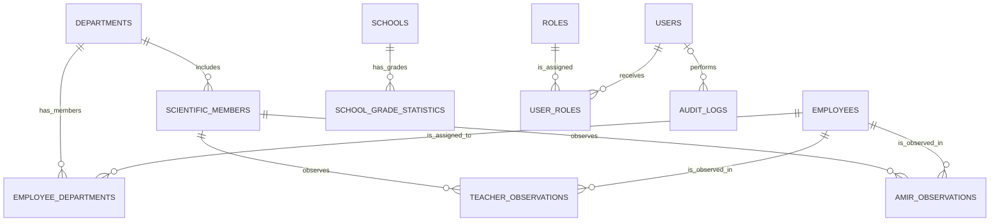

# PostgreSQL Relational Database Design

## 1. Scope and design status

This is a documentation-only relational design for PostgreSQL. It does not add
FastAPI code, SQLAlchemy models, Alembic migrations, or SQL files.

The design implements the supplied data relationships without duplicating
employee data. Items marked **TBD** require the referenced Excel form or a
business decision before a migration is created; they are not proposed as
guessed fields or rules.

## 2. Database-wide conventions

### 2.1 Naming, identifiers, and labels

- Table names, column names, API fields, and internal codes are English and use
  `snake_case`.
- Each primary key is `BIGINT GENERATED ALWAYS AS IDENTITY`. PostgreSQL creates
  its value, so application code and seed data never hard-code database IDs.
- Persian/Dari labels are not stored as enum keys or shown from internal values.
  The UI resolves stable internal codes through centralized Persian/Dari label
  mappings.
- `departments.code`, `employees.job_title_code`, and
  `employees.field_match_code` are `TEXT` codes, not PostgreSQL enums. Their
  permitted vocabularies are pending, so no guessed `CHECK` lists are added.

### 2.2 Timestamps and soft deletion

- Important domain tables use `created_at TIMESTAMPTZ NOT NULL DEFAULT
  CURRENT_TIMESTAMP` and `updated_at TIMESTAMPTZ NOT NULL DEFAULT
  CURRENT_TIMESTAMP`.
- The application or an approved database trigger must update `updated_at` on
  every modification; this document does not prescribe the implementation.
- Soft-deletable tables have `deleted_at TIMESTAMPTZ NULL DEFAULT NULL`.
  Ordinary reads, filters, department results, counts, and exports must exclude
  rows where `deleted_at IS NOT NULL` unless a future explicit rule says
  otherwise.
- Soft delete is used for independent business records and the
  employee/department assignment. It is not used for immutable audit records.

### 2.3 Requiredness notation

- **Yes** means the requirement is sufficiently defined to use `NOT NULL`.
- **No** means the column is intentionally nullable.
- **TBD** means the field must exist, but the requirements do not yet state
  whether it is mandatory; no `NOT NULL` decision should be implemented yet.

## 3. Relationship diagram

`SCHOOL_GRADE_STATISTICS` is an approved child table for the grade 1 through 12
statistics supplied by the Schools Excel requirements.

## 4. Core tables

### 4.1 `employees`

**Purpose:** The single authoritative store for employee personnel data. No
department or observation table may copy these personnel columns.

| Column | PostgreSQL type | Required | Default | Key / constraint / notes |
| --- | --- | --- | --- | --- |
| `id` | `BIGINT GENERATED ALWAYS AS IDENTITY` | Yes | identity | Primary key |
| `name` | `TEXT` | Yes | none | Employee name (اسم) |
| `father_name` | `TEXT` | Yes | none | Father name (ولد) |
| `grandfather_name` | `TEXT` | Yes | none | Grandfather name (ولدیت) |
| `school_workplace` | `TEXT` | Yes | none | School/workplace (مکتب); not a foreign key because employee data must not make Schools a dependent module |
| `city_district` | `TEXT` | Yes | none | Required column for شهر/ولسوالی |
| `phone_number` | `TEXT` | Yes | none | Phone number; `TEXT` preserves leading zeroes and input formatting |
| `field_of_study` | `TEXT` | Yes | none | رشته تحصیلی |
| `education_level` | `TEXT` | Yes | none | درجه تحصیل |
| `subjects_taught` | `TEXT` | Yes | none | Free-text field; must not become a comma-separated department relation or controlled subject list |
| `job_title_code` | `TEXT` | Yes | none | Stable internal job-title value; UI uses centralized Persian/Dari mapping |
| `teaching_experience` | `INTEGER` | Yes | none | سابقه تدریس; integer-compatible value |
| `grade_post` | `INTEGER` | Yes | none | بست; integer-compatible value |
| `step` | `INTEGER` | Yes | none | قدم; integer-compatible value |
| `successful_evaluation` | `TEXT` | Yes | none | ارزیابی موفق; allowed values pending |
| `field_match_code` | `TEXT` | Yes | none | Stable internal field-match value; UI uses centralized Persian/Dari mapping |
| `notes` | `TEXT` | No | `NULL` | ملاحظات; long text |
| `created_at` | `TIMESTAMPTZ` | Yes | `CURRENT_TIMESTAMP` | Creation timestamp |
| `updated_at` | `TIMESTAMPTZ` | Yes | `CURRENT_TIMESTAMP` | Modification timestamp |
| `deleted_at` | `TIMESTAMPTZ` | No | `NULL` | Soft-delete marker |

**Foreign keys:** None. `school_workplace` remains employee-provided text;
Schools is explicitly an independent module, and no supplied rule defines a
relationship between it and employees.

**Unique constraints:** None are proposed. No employee natural-key or
deduplication rule has been supplied.

**Indexes:**

- B-tree index on `job_title_code` for job-title filtering.
- B-tree index on `field_match_code` for field-match filtering.
- B-tree index on `city_district` for location filtering when enabled.
- B-tree index on `school_workplace` for workplace filtering when enabled.
- B-tree index on `deleted_at` only if query planning shows it useful; every
  normal query must nevertheless exclude soft-deleted rows.

**Soft-delete behavior:** Set `deleted_at`; do not hard-delete an employee as a
normal action. The exact restore and historical-observation behavior is TBD.

### 4.2 `departments`

**Purpose:** Stores the predefined department catalogue. A stable code allows
services and label mappings to identify a department without hard-coding its
database ID.

| Column | PostgreSQL type | Required | Default | Key / constraint / notes |
| --- | --- | --- | --- | --- |
| `id` | `BIGINT GENERATED ALWAYS AS IDENTITY` | Yes | identity | Primary key |
| `code` | `TEXT` | Yes | none | Stable, English internal department code; unique |
| `created_at` | `TIMESTAMPTZ` | Yes | `CURRENT_TIMESTAMP` | Creation timestamp |
| `updated_at` | `TIMESTAMPTZ` | Yes | `CURRENT_TIMESTAMP` | Modification timestamp |
| `deleted_at` | `TIMESTAMPTZ` | No | `NULL` | Soft-delete marker |

**Foreign keys:** None.

**Unique constraints:** `UNIQUE (code)`. A department code remains unique even
if the department is soft-deleted, preventing a different department from
reusing the same stable identity.

**Indexes:** The unique constraint indexes `code`; add an index on
`deleted_at` only if query planning justifies it.

**Soft-delete behavior:** A deleted department is excluded from ordinary
department lists and new assignments. Existing assignments must not be silently
rewritten; the exact historical display policy is TBD.

**Mandatory non-teacher rule:** This is deliberately **not** a database ID
constraint. The service layer must resolve the department using its stable code
(for example, the code mapped to **تعلیم و تربیه**) and, when an employee's
`job_title_code` is not the code mapped to **معلم**, ensure an active
`employee_departments` row exists. The service must also permit additional
departments for non-teachers. This rule must be validated server-side, not only
in the UI.

### 4.3 `employee_departments`

**Purpose:** Explicit many-to-many association between employees and
departments. It permits one employee to appear in every assigned department
without duplicating employee data.

| Column | PostgreSQL type | Required | Default | Key / constraint / notes |
| --- | --- | --- | --- | --- |
| `id` | `BIGINT GENERATED ALWAYS AS IDENTITY` | Yes | identity | Primary key |
| `employee_id` | `BIGINT` | Yes | none | Foreign key to `employees.id` |
| `department_id` | `BIGINT` | Yes | none | Foreign key to `departments.id` |
| `created_at` | `TIMESTAMPTZ` | Yes | `CURRENT_TIMESTAMP` | Assignment creation timestamp |
| `updated_at` | `TIMESTAMPTZ` | Yes | `CURRENT_TIMESTAMP` | Assignment modification timestamp |
| `deleted_at` | `TIMESTAMPTZ` | No | `NULL` | Assignment soft-delete marker |

**Foreign keys:**

- `employee_id REFERENCES employees(id)`.
- `department_id REFERENCES departments(id)`.
- Delete actions must be restrictive while records remain referenced; ordinary
  removal uses soft delete rather than cascading hard deletion.

**Unique constraints:** A partial unique index on
`(employee_id, department_id) WHERE deleted_at IS NULL` prevents duplicate
active assignments while allowing a previously removed assignment to be
recorded again.

**Indexes:**

- B-tree index on `(department_id, employee_id)` for a department page's
  employee result.
- B-tree index on `(employee_id, department_id)` for an employee's selected
  departments and service validation.
- The partial unique index above also supports active-pair lookup.

**Soft-delete behavior:** Removing a department selection sets `deleted_at`.
Active department queries require `deleted_at IS NULL`.

### 4.4 `scientific_members`

**Purpose:** Independent store for Scientific Members, who can be selected as
observers and can each perform many observations.

| Column | PostgreSQL type | Required | Default | Key / constraint / notes |
| --- | --- | --- | --- | --- |
| `id` | `BIGINT GENERATED ALWAYS AS IDENTITY` | Yes | identity | Primary key |
| `name` | `TEXT` | TBD | none | اسم |
| `surname` | `TEXT` | TBD | none | تخلص |
| `father_name` | `TEXT` | TBD | none | ولد |
| `phone_number` | `TEXT` | TBD | none | شماره تماس |
| `academic_rank` | `TEXT` | TBD | none | رتبه علمی |
| `department_id` | `BIGINT` | Yes | none | Foreign key to `departments.id`; selected existing system department |
| `notes` | `TEXT` | No | `NULL` | ملاحظات; long text |
| `created_at` | `TIMESTAMPTZ` | Yes | `CURRENT_TIMESTAMP` | Creation timestamp |
| `updated_at` | `TIMESTAMPTZ` | Yes | `CURRENT_TIMESTAMP` | Modification timestamp |
| `deleted_at` | `TIMESTAMPTZ` | No | `NULL` | Soft-delete marker |

**Foreign keys:** `department_id REFERENCES departments(id)`. Scientific Members
select an existing system department, so this foreign key preserves the
catalogue relationship without storing a free-text department value.

**Unique constraints:** None are proposed because no natural identifier or
uniqueness rule is supplied.

**Indexes:** B-tree index on `department_id` for department filtering and
joins; B-tree index on `academic_rank` (if filtering
requires it), and `deleted_at` if demonstrated useful.

**Soft-delete behavior:** Set `deleted_at` instead of deleting an observer that
may be referenced by historical observations. New observation forms should not
offer a soft-deleted member.

### 4.5 `teacher_observations`

**Purpose:** Stores Teacher Observation records separately from Amir/Senior
Teacher observations, including the six Teacher competencies and the selected
Scientific Member observer.

| Column | PostgreSQL type | Required | Default | Key / constraint / notes |
| --- | --- | --- | --- | --- |
| `id` | `BIGINT GENERATED ALWAYS AS IDENTITY` | Yes | identity | Primary key |
| `employee_id` | `BIGINT` | Yes | none | Foreign key to observed employee |
| `observer_scientific_member_id` | `BIGINT` | Yes | none | Foreign key to the observing Scientific Member |
| `observation_date` | `DATE` | TBD | none | تاریخ مشاهده |
| `observed_class` | `TEXT` | TBD | none | صنف مشاهده شده |
| `subject` | `TEXT` | TBD | none | مضمون |
| `subject_knowledge_score` | `NUMERIC(4,2)` | TBD | none | دانش مضمونی; `CHECK (value >= 0 AND value <= 3)` when non-null |
| `lesson_plan_score` | `NUMERIC(4,2)` | TBD | none | پلان درسی; same bounded check |
| `classroom_management_score` | `NUMERIC(4,2)` | TBD | none | مدیریت صنف; same bounded check |
| `assessment_score` | `NUMERIC(4,2)` | TBD | none | ارزیابی; same bounded check |
| `professional_learning_score` | `NUMERIC(4,2)` | TBD | none | آموزش های مسلکی; same bounded check |
| `community_engagement_score` | `NUMERIC(4,2)` | TBD | none | ارتباط با اجتماع; same bounded check |
| `total_score` | `NUMERIC` | No | `NULL` | Server-controlled calculated value; clients cannot set it |
| `final_result_code` | `TEXT` | No | `NULL` | Server-controlled calculated internal result; clients cannot set it; UI label mapping only |
| `strengths` | `TEXT` | No | `NULL` | نکات قوت; long text / textarea |
| `improvements` | `TEXT` | No | `NULL` | نکات قابل اصلاح; long text / textarea |
| `notes` | `TEXT` | No | `NULL` | ملاحظات; long text / textarea |
| `created_at` | `TIMESTAMPTZ` | Yes | `CURRENT_TIMESTAMP` | Creation timestamp |
| `updated_at` | `TIMESTAMPTZ` | Yes | `CURRENT_TIMESTAMP` | Modification timestamp |
| `deleted_at` | `TIMESTAMPTZ` | No | `NULL` | Soft-delete marker |

**Foreign keys:**

- `employee_id REFERENCES employees(id)` exists because one employee can have
  many Teacher Observations.
- `observer_scientific_member_id REFERENCES scientific_members(id)` exists
  because one Scientific Member can observe many records.
- Both foreign keys should restrict hard deletion; soft deletion preserves
  historical observation references.

**Unique constraints:** None. The requirements permit multiple observations for
the same employee, including on the same date unless a later rule forbids it.

**Indexes:**

- B-tree index on `(employee_id, observation_date DESC)` for employee details.
- B-tree index on `(observer_scientific_member_id, observation_date DESC)` for
  the Scientific Member observation count/list action.
- B-tree index on `observation_date` for date filtering.
- Index on `deleted_at` only when demonstrated useful.

**Scoring behavior:** The bounded per-competency checks allow values from 0
through 3. `total_score` and `final_result_code` are server-controlled service
layer values; clients must not set them directly. Final-result classification
uses the exact calculated decimal total and never rounds it. Totals below
`1.00`, or otherwise outside an approved range, remain `NULL`.
The known display mappings, to be resolved through UI label mappings rather than
database enum labels, are:

| Teacher competency score | Display result |
| --- | --- |
| 0–0.75 | قابلیت مشاهده نشد |
| 0.76–1.5 | نیازمند بهبود |
| 1.6–2.25 | دارای قابلیت |
| 2.26–3 | تسلط بر قابلیت |

| Teacher total score | Display result |
| --- | --- |
| 1.00–10.99 | نیازمند بهبود |
| 11.00–14.99 | دارای قابلیت |
| 15.00–18.00 | تسلط بر قابلیت |

**Soft-delete behavior:** Set `deleted_at`; do not remove historical observation
data through ordinary deletion.

### 4.6 `amir_observations`

**Purpose:** Stores Amir/Senior Teacher Observation records independently from
Teacher Observations, using its own four competency fields.

| Column | PostgreSQL type | Required | Default | Key / constraint / notes |
| --- | --- | --- | --- | --- |
| `id` | `BIGINT GENERATED ALWAYS AS IDENTITY` | Yes | identity | Primary key |
| `employee_id` | `BIGINT` | Yes | none | Foreign key to observed employee |
| `observer_scientific_member_id` | `BIGINT` | Yes | none | Foreign key to observing Scientific Member |
| `observation_date` | `DATE` | TBD | none | تاریخ مشاهده |
| `observed_class` | `TEXT` | TBD | none | صنف مشاهده شده |
| `subject` | `TEXT` | TBD | none | مضمون |
| `responsibility_score` | `NUMERIC(4,2)` | TBD | none | مسوولیت پذیری; `CHECK (value >= 0 AND value <= 3)` when non-null |
| `professional_leadership_score` | `NUMERIC(4,2)` | TBD | none | رهبری مسلکی; same bounded check |
| `community_relations_score` | `NUMERIC(4,2)` | TBD | none | روابط با جامعه; same bounded check |
| `professional_development_score` | `NUMERIC(4,2)` | TBD | none | انکشاف مسلکی; same bounded check |
| `total_score` | `NUMERIC` | No | `NULL` | Server-controlled calculated value; clients cannot set it |
| `final_result_code` | `TEXT` | No | `NULL` | Server-controlled calculated internal result; clients cannot set it; UI label mapping only |
| `strengths` | `TEXT` | No | `NULL` | نکات قوت; long-text UI field |
| `improvements` | `TEXT` | No | `NULL` | نکات قابل اصلاح; long-text UI field |
| `notes` | `TEXT` | No | `NULL` | ملاحظات; long-text UI field |
| `created_at` | `TIMESTAMPTZ` | Yes | `CURRENT_TIMESTAMP` | Creation timestamp |
| `updated_at` | `TIMESTAMPTZ` | Yes | `CURRENT_TIMESTAMP` | Modification timestamp |
| `deleted_at` | `TIMESTAMPTZ` | No | `NULL` | Soft-delete marker |

**Foreign keys:**

- `employee_id REFERENCES employees(id)` supports multiple Amir/Senior Teacher
  observations per employee.
- `observer_scientific_member_id REFERENCES scientific_members(id)` supports a
  Scientific Member observing many records and a unified observation count/list
  across both observation tables.

**Unique constraints:** None. Multiple observation records per employee are
allowed.

**Indexes:**

- B-tree index on `(employee_id, observation_date DESC)`.
- B-tree index on `(observer_scientific_member_id, observation_date DESC)`.
- B-tree index on `observation_date`.
- Index on `deleted_at` only when demonstrated useful.

**Scoring behavior:** Per-competency checks permit only 0 through 3. The
service layer controls `total_score` and `final_result_code`; clients cannot
set them. Final-result classification uses the exact calculated decimal total
without rounding. Totals below `1.00`, or otherwise outside an approved range,
remain `NULL`.

| Amir/Senior Teacher competency score | Display result |
| --- | --- |
| 0–0.75 | غیر قابل ارزیابی |
| 0.76–1.5 | نیازمند بهبود |
| 1.6–2.25 | دارای قابلیت |
| 2.26–3 | تسلط بر قابلیت |

| Amir/Senior Teacher total score | Display result |
| --- | --- |
| 1.00–4.99 | قابلیت ابتدایی |
| 5.00–8.99 | قابلیت بکارگیری |
| 9.00–12.00 | مسلط بر قابلیت |

**Soft-delete behavior:** Set `deleted_at`; do not hard-delete ordinary
historical observation data.

### 4.7 `schools`

**Purpose:** Independent Schools module. It must not reference employees or
reuse employee personnel columns.

| Column | PostgreSQL type | Required | Default | Key / constraint / notes |
| --- | --- | --- | --- | --- |
| `id` | `BIGINT GENERATED ALWAYS AS IDENTITY` | Yes | identity | Primary key |
| `school_name` | `TEXT` | Yes | none | School name |
| `school_head_phone` | `TEXT` | No | `NULL` | School head phone; `TEXT` preserves leading zeroes and formatting |
| `school_type_code` | `TEXT` | Yes | none | Stable internal school-type value; UI uses Persian/Dari label mapping |
| `gender_type_code` | `TEXT` | Yes | none | Stable internal gender/type value; UI uses Persian/Dari label mapping |
| `school_code` | `TEXT` | Yes | none | School code; unique |
| `school_formation` | `TEXT` | Yes | none | School formation |
| `senior_teacher_count` | `INTEGER` | Yes | `0` | Number of senior teachers; `CHECK (value >= 0)` |
| `male_teacher_count` | `INTEGER` | Yes | `0` | Number of male teachers; `CHECK (value >= 0)` |
| `female_teacher_count` | `INTEGER` | Yes | `0` | Number of female teachers; `CHECK (value >= 0)` |
| `incoming_service_teacher_count` | `INTEGER` | Yes | `0` | Number of incoming service teachers; `CHECK (value >= 0)` |
| `outgoing_service_teacher_count` | `INTEGER` | Yes | `0` | Number of outgoing service teachers; `CHECK (value >= 0)` |
| `volunteer_teacher_count` | `INTEGER` | Yes | `0` | Number of volunteer teachers; `CHECK (value >= 0)` |
| `active_class_section_count` | `INTEGER` | Yes | `0` | Number of active class sections; `CHECK (value >= 0)` |
| `school_needs` | `TEXT` | No | `NULL` | School needs; long descriptive text |
| `school_equipment` | `TEXT` | No | `NULL` | School equipment; long descriptive text |
| `created_at` | `TIMESTAMPTZ` | Yes | `CURRENT_TIMESTAMP` | Creation timestamp |
| `updated_at` | `TIMESTAMPTZ` | Yes | `CURRENT_TIMESTAMP` | Modification timestamp |
| `deleted_at` | `TIMESTAMPTZ` | No | `NULL` | Soft-delete marker |

**Foreign keys:** None are currently defined. Schools are an independent module.

**Unique constraints:** `UNIQUE (school_code)`. The code remains unique even
after soft deletion so it continues to identify the same school consistently.

**Indexes:**

- The unique constraint indexes `school_code`.
- B-tree index on `school_name` for school-name lookup.
- B-tree indexes on `school_type_code`, `gender_type_code`, and
  `school_formation` for filtering.
- Index `deleted_at` only if query planning demonstrates a benefit.

**Soft-delete behavior:** Set `deleted_at`; the precise restore and export
handling is pending.

### 4.8 `school_grade_statistics`

**Purpose:** Stores the approved per-school statistics for grades 1 through 12.
Keeping each grade in its own row supports school lookup, filtering, and export
without repeating the School's own fields.

| Column | PostgreSQL type | Required | Default | Key / constraint / notes |
| --- | --- | --- | --- | --- |
| `id` | `BIGINT GENERATED ALWAYS AS IDENTITY` | Yes | identity | Primary key |
| `school_id` | `BIGINT` | Yes | none | Foreign key to `schools.id` |
| `grade_number` | `SMALLINT` | Yes | none | `CHECK (grade_number BETWEEN 1 AND 12)` |
| `enrolled_count` | `INTEGER` | Yes | `0` | `CHECK (enrolled_count >= 0)` |
| `present_count` | `INTEGER` | Yes | `0` | `CHECK (present_count >= 0 AND present_count <= enrolled_count)` |
| `female_count` | `INTEGER` | Yes | `0` | `CHECK (female_count >= 0)` |
| `male_count` | `INTEGER` | Yes | `0` | `CHECK (male_count >= 0)` |
| `created_at` | `TIMESTAMPTZ` | Yes | `CURRENT_TIMESTAMP` | Creation timestamp |
| `updated_at` | `TIMESTAMPTZ` | Yes | `CURRENT_TIMESTAMP` | Modification timestamp |
| `deleted_at` | `TIMESTAMPTZ` | No | `NULL` | Soft-delete marker |

**Relationship reason:** One School has one record for each supported grade,
and grade statistics cannot exist without their School.

**Foreign keys:** `school_id REFERENCES schools(id)`. Hard deletion must be
restricted; ordinary removal uses the soft-delete marker.

**Unique constraints:** Partial unique index on `(school_id, grade_number)`
where `deleted_at IS NULL`, which ensures one active statistics record for a
School and grade while preserving soft-deleted history.

**Count rule:** `present_count` must not exceed `enrolled_count`. The schema
does not constrain `male_count + female_count = enrolled_count`; that equality
has not been approved as a business rule.

**Indexes:** The unique constraint indexes `(school_id, grade_number)` and
supports school lookup. Add a B-tree index on `grade_number` for cross-school
grade filtering; index `deleted_at` only when query planning demonstrates a
benefit.

**Soft-delete behavior:** Set `deleted_at`; active statistics queries exclude
soft-deleted records.

## 5. Future access-control tables

These tables support the requested future Authentication, Roles, and Audit Logs
features. Their presence in this design does not authorize implementation before
the future requirements are finalized.

### 5.1 `users`

**Purpose:** Future authenticated-user account. It is separate from `employees`
because a user account is an access-control identity, not employee personnel
data.

| Column | PostgreSQL type | Required | Default | Key / constraint / notes |
| --- | --- | --- | --- | --- |
| `id` | `BIGINT GENERATED ALWAYS AS IDENTITY` | Yes | identity | Primary key |
| `login_identifier` | `TEXT` | Yes | none | Login name/identifier; authentication method is TBD |
| `password_hash` | `TEXT` | No | `NULL` | Only for a future password-based method; never a plaintext password |
| `is_active` | `BOOLEAN` | Yes | `TRUE` | Future account enablement flag |
| `last_login_at` | `TIMESTAMPTZ` | No | `NULL` | Future authentication metadata |
| `created_at` | `TIMESTAMPTZ` | Yes | `CURRENT_TIMESTAMP` | Creation timestamp |
| `updated_at` | `TIMESTAMPTZ` | Yes | `CURRENT_TIMESTAMP` | Modification timestamp |
| `deleted_at` | `TIMESTAMPTZ` | No | `NULL` | Soft-delete marker |

**Foreign keys:** None. A user-to-employee relationship has not been supplied
and must not be invented.

**Unique constraints:** Partial unique index on
`login_identifier WHERE deleted_at IS NULL`, allowing a deleted account's
identifier to be reused only if future policy permits it.

**Indexes:** The partial unique index above; index `is_active` only if account
administration queries demonstrate a need.

**Soft-delete behavior:** Set `deleted_at`; disable the account through
`is_active` according to future authentication policy.

### 5.2 `roles`

**Purpose:** Future role catalogue used by role-based authorization.

| Column | PostgreSQL type | Required | Default | Key / constraint / notes |
| --- | --- | --- | --- | --- |
| `id` | `BIGINT GENERATED ALWAYS AS IDENTITY` | Yes | identity | Primary key |
| `code` | `TEXT` | Yes | none | Stable internal role code; UI label comes from centralized mapping |
| `created_at` | `TIMESTAMPTZ` | Yes | `CURRENT_TIMESTAMP` | Creation timestamp |
| `updated_at` | `TIMESTAMPTZ` | Yes | `CURRENT_TIMESTAMP` | Modification timestamp |
| `deleted_at` | `TIMESTAMPTZ` | No | `NULL` | Soft-delete marker |

**Foreign keys:** None.

**Unique constraints:** `UNIQUE (code)`.

**Indexes:** The unique constraint indexes `code`; add `deleted_at` indexing
only if query planning requires it.

**Soft-delete behavior:** Soft-deleted roles cannot be assigned. The role and
permission matrix remains a future requirement.

### 5.3 `user_roles`

**Purpose:** Many-to-many association that permits a user to hold multiple roles
and a role to be assigned to multiple users.

| Column | PostgreSQL type | Required | Default | Key / constraint / notes |
| --- | --- | --- | --- | --- |
| `id` | `BIGINT GENERATED ALWAYS AS IDENTITY` | Yes | identity | Primary key |
| `user_id` | `BIGINT` | Yes | none | Foreign key to `users.id` |
| `role_id` | `BIGINT` | Yes | none | Foreign key to `roles.id` |
| `created_at` | `TIMESTAMPTZ` | Yes | `CURRENT_TIMESTAMP` | Assignment creation timestamp |
| `updated_at` | `TIMESTAMPTZ` | Yes | `CURRENT_TIMESTAMP` | Assignment modification timestamp |
| `deleted_at` | `TIMESTAMPTZ` | No | `NULL` | Assignment soft-delete marker |

**Foreign keys:** `user_id REFERENCES users(id)` and `role_id REFERENCES
roles(id)`. Both exist to represent the future many-to-many role assignment
without copying role values into `users`.

**Unique constraints:** Partial unique index on `(user_id, role_id) WHERE
deleted_at IS NULL` prevents duplicate active role assignments while preserving
the ability to record a later re-assignment.

**Indexes:** B-tree indexes on `(user_id, role_id)` and `(role_id, user_id)`;
the partial unique index supports active assignment lookup.

**Soft-delete behavior:** Removing a role assignment sets `deleted_at`. The
future authorization service uses active assignments only.

### 5.4 `audit_logs`

**Purpose:** Future append-only record of material application actions. It
supports actor lookup and entity history without forcing every audited entity
into a common parent table.

| Column | PostgreSQL type | Required | Default | Key / constraint / notes |
| --- | --- | --- | --- | --- |
| `id` | `BIGINT GENERATED ALWAYS AS IDENTITY` | Yes | identity | Primary key |
| `actor_user_id` | `BIGINT` | No | `NULL` | Foreign key to `users.id`; nullable for system/unknown actors |
| `action_code` | `TEXT` | Yes | none | Stable internal action code; future vocabulary |
| `entity_type` | `TEXT` | Yes | none | Stable internal table/entity type code |
| `entity_id` | `BIGINT` | Yes | none | Identifier of the affected entity; generic reference cannot have a single SQL foreign key |
| `before_data` | `JSONB` | No | `NULL` | Future pre-change snapshot/payload; exact scope TBD |
| `after_data` | `JSONB` | No | `NULL` | Future post-change snapshot/payload; exact scope TBD |
| `created_at` | `TIMESTAMPTZ` | Yes | `CURRENT_TIMESTAMP` | Time the audit event was recorded |

**Foreign keys:** `actor_user_id REFERENCES users(id) ON DELETE SET NULL`.
`entity_type` plus `entity_id` is intentionally not an SQL foreign key because
an audit event may refer to any of several tables. Application validation will
be defined with the audit-log requirements.

**Unique constraints:** None; separate actions may legitimately concern the
same entity at the same time.

**Indexes:**

- B-tree index on `(entity_type, entity_id, created_at DESC)` for an entity's
  audit history.
- B-tree index on `(actor_user_id, created_at DESC)` for actor history.
- B-tree index on `created_at DESC` for chronological reporting.

**Timestamps and deletion:** `audit_logs` has `created_at` only. It has no
`updated_at` or `deleted_at` because audit entries should be append-only and
immutable; retention and access policy are future decisions.

## 6. Relationship rationale

| Relationship | Why it exists |
| --- | --- |
| `employees` → `employee_departments` ← `departments` | Implements mandatory many-to-many department assignment, lets one employee appear in many department pages, and avoids copying personnel data. |
| `departments` → `scientific_members` | A Scientific Member selects an existing system department, so `department_id` preserves the catalogue relationship and prevents an unrelated free-text department value. |
| `employees` → `teacher_observations` | Preserves the requirement that a teacher/employee may receive many Teacher Observations. |
| `employees` → `amir_observations` | Preserves the requirement that an employee may receive many Amir/Senior Teacher Observations. |
| `scientific_members` → observation tables | Identifies the observer and supports the Scientific Member UI action that counts and lists observations performed. |
| `schools` → `school_grade_statistics` | Stores one grade 1–12 statistics row per School and prevents repeated School details in each grade record. |
| `users` → `user_roles` ← `roles` | Supports future many-to-many role assignment without storing role names directly on user accounts. |
| `users` → `audit_logs` | Associates a future audit event with its actor while allowing system-generated events to have no user. |

## 7. Filter and export support

- Employee filters use indexed employee columns and join through
  `employee_departments` only when a department filter is active. The query must
  return complete employee records, not merely the compact list columns.
- Department results query active `employee_departments` joined to active
  employees, so an employee appears in each assigned department without any
  copied data.
- Teacher and Amir observation lists use their employee, observer, and date
  indexes. The two tables remain separate; a Scientific Member's observation
  count/list is a combined read across them, excluding soft-deleted rows.
- School filters use indexes on school code, name, type, gender/type, and
  formation. Grade-statistics lookup uses `(school_id, grade_number)`.
- Excel export uses the same active filter criteria as the corresponding list
  query and exports complete matching records. It must not export all rows when
  the active filters select only a subset.

## 8. Explicitly deferred decisions

- The authoritative department-code catalogue, including the exact stable code
  for **تعلیم و تربیه** and **معلم**.
- Required/optional status, formats, allowed values, and uniqueness rules for
  unfinalized business-input fields.
- All unprovided columns from the Scientific Member, Teacher Observation,
  and Amir Observation Excel forms.
- Observation competency decimal-gap behavior. Final-result totals are
  server-controlled and use the approved exact-decimal ranges without rounding.
- Authentication method, role codes, permissions, audit event vocabulary,
  retention, and access policy.
